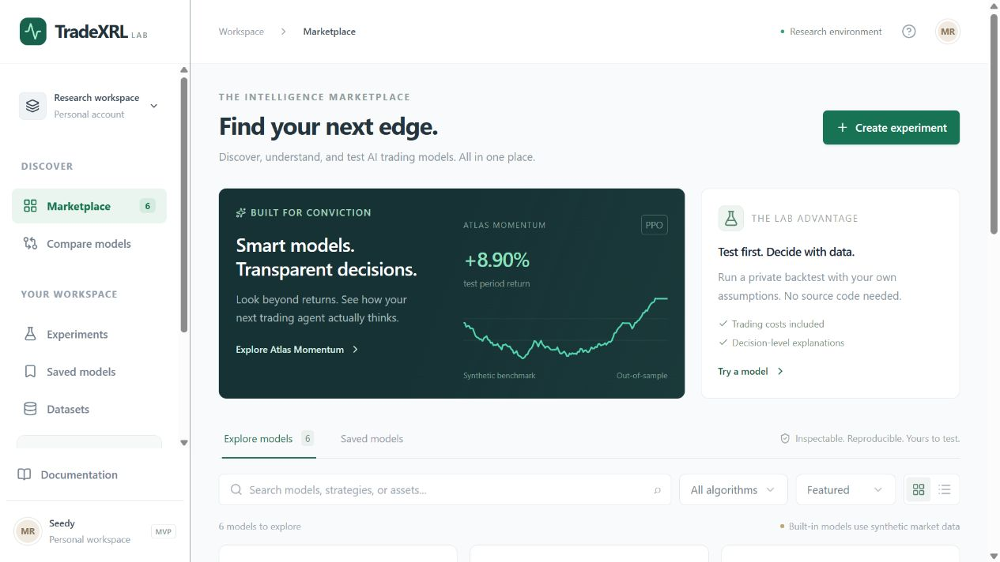
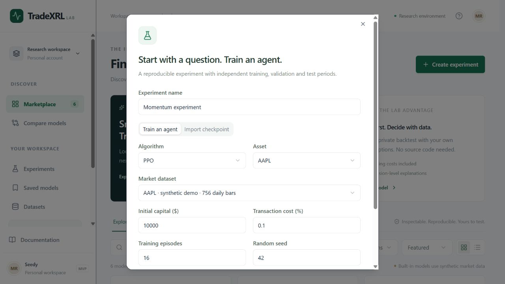
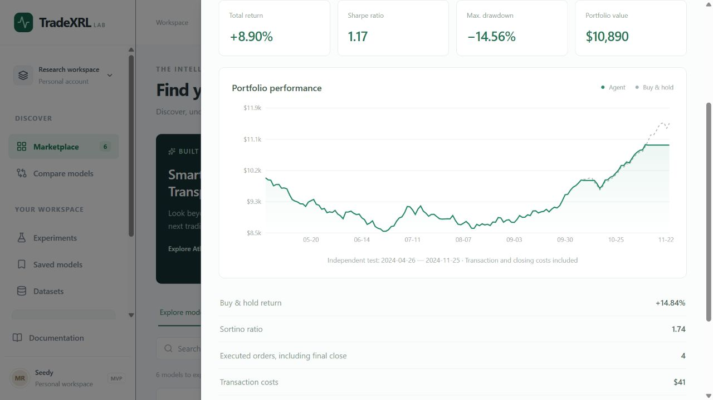
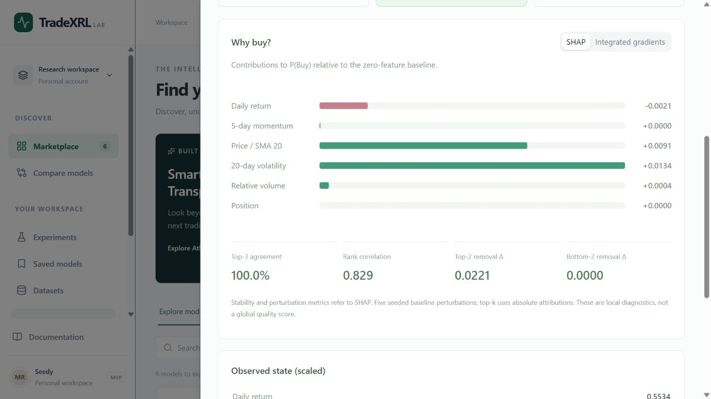

  

<h1 align="center">Tradevia</h1>

  <strong>A home for AI in trading.</strong> 
  Explore ideas. Test models. Understand decisions.

  <a href="#the-vision">The vision</a> ·
  <a href="#available-today">Available today</a> ·
  <a href="#inside-the-lab">Inside the lab</a> ·
  <a href="docs/DEVELOPMENT.md">Run locally</a>

---

Tradevia is a platform in development for bringing artificial intelligence into trading and financial markets. Its vision connects research and experimentation with a place to present AI models, discover trading agents, and access services or commission custom solutions.

Screenshots show the current TradeXRL Lab interface. All displayed results use synthetic demonstration data.

## The vision

A shared space for researchers, builders, traders, and teams working with AI in financial markets.

| Research & testing | Showcase & discovery | Services & custom work |
| --- | --- | --- |
| Develop ideas and evaluate how models behave. | Present models and trading agents for others to explore and try without sharing source code. | Connect with creators, purchase access to services, or commission a tailored solution. |

These are the broader directions for Tradevia as the platform grows.

## Available today

**The RL laboratory and its explainability tools are currently active.**

- **RL Lab** — train and test reinforcement-learning trading agents, then explore their results.
- **Explainability** — inspect individual decisions and understand which inputs influenced the agent.

The broader showcase, service marketplace, and custom-order experience remain part of the product vision.

## Inside the lab

### Set up an experiment

Choose an agent, a dataset, and your experiment settings in one workspace.

### Explore the results

Review portfolio behavior and compare the agent's performance with a reference strategy.

### Understand a decision

Look inside an agent's choice and see how individual features contributed to it.

## Get started

See the **[development guide](docs/DEVELOPMENT.md)** for local setup, research methodology, and technical details.
